# 第六次作业

*王宇桁 自动化61 2160504021*

-------------------------------------

作业内容：

1.在测试图像上产生高斯噪声lena图-需能指定均值和方差；并用多种滤波器恢复图像，分析各自优缺点；
2.在测试图像lena图加入椒盐噪声（椒和盐噪声密度均是0.1）；用学过的滤波器恢复图像；在使用反谐波分析Q大于0和小于0的作用；

3.推导维纳滤波器并实现下边要求；
(a) 实现模糊滤波器如方程Eq. (5.6-11).
(b) 模糊lena图像：45度方向，T=1；
(c) 再模糊的lena图像中增加高斯噪声，均值= 0 ，方差=10 pixels 以产生模糊图像；
(d)分别利用方程 Eq. (5.8-6)和(5.9-4)，恢复图像；并分析算法的优缺点.

----------------------------------

## 摘要

本次作业主要使用c++与OpenCV作为工具，实现对图像添加噪声，滤波，最后实现对图像的模糊处理，并设计维纳滤波器进行复原。

-------------------------

1. **含高斯噪声的图像复原**

   * 高斯噪声简介

     > 高斯噪声是指它的概率密度函数服从高斯分布（即正态分布）的一类噪声。常见的高斯噪声包括起伏噪声、宇宙噪声、热噪声和散粒噪声等等。除常用抑制噪声的方法外，对高斯噪声的抑制方法常常采用数理统计方法。

     其中，高斯分布函数如下：

     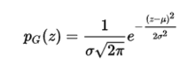

   * 处理结果

     根据高斯分布函数可以在原图中添加高斯噪声均值为10，方差为30，效果如下：

     

     之后分别使用`Butterworth低通滤波`,`频域高斯低通滤波`,`空域中值滤波`,`空域高斯滤波` 进行滤波处理如下：

     * Butterworth低通滤波

       

     * 频域高斯低通滤波

       

     * 空域中值滤波

       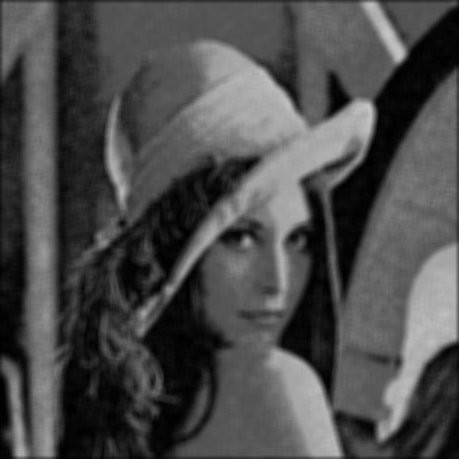

     * 空域高斯滤波

       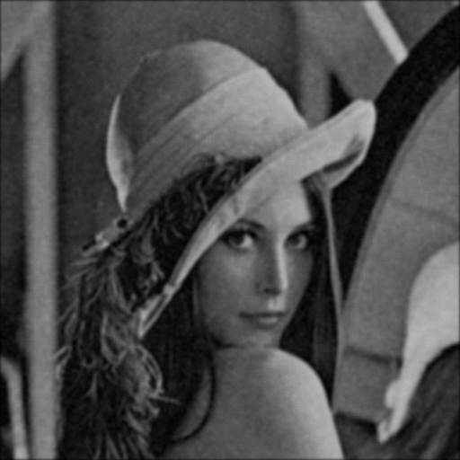

   * 结果分析

     由上面的实验结果可以看出，能够顺利实现在原图上添加高斯噪声的功能。

     在滤波中，四种滤波器都能对高斯噪声进行滤除，但代价是图像变得模糊。

     由结果可见，频域滤波后的图片亮度更贴近原图，空域滤波显得较暗。

   -------------------------------------------

   

2. **含椒盐噪声的图像复原**

   * 椒盐噪声简介

     > **椒盐噪声**也称为**脉冲噪声**，是图像，它是一种随机出现的白点或者黑点，可能是亮的区域有黑色像素或是在暗的区域有白色像素（或是两者皆有）。盐和胡椒噪声的成因可能是影像讯号受到突如其来的强烈干扰而产生、类比数位转换器或位元传输错误等。例如失效的感应器导致像素值为最小值，饱和的感应器导致像素值为最大值。

     其中，概率分布函数如下：

     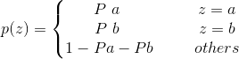

   * 逆谐波分析简介

     **逆谐波均值滤波器 Contra-Harmonic Mean Filter**其公式如下：

     .gif)

     其中Q称为滤波器的阶数，该滤波器可以用来消除椒盐噪声。但是需要不同同时处理盐粒噪声和胡椒噪声，当Q为正时，可以消除胡椒噪声；当Q为负时，消除盐粒噪声。当Q=0时，该滤波器退化为算术均值滤波器；Q=-1时，退化为谐波均值滤波器。

   * 处理结果

     根据椒盐噪声的概率分布函数，可以在原图上添加密度为0.1的椒盐噪声如下：

     

     首先使用`Butterworth低通滤波`,`频域高斯低通滤波`,`空域中值滤波`,`空域高斯滤波` 进行滤波处理如下：

     * Butterworth低通滤波

       

     * 频域高斯低通滤波

       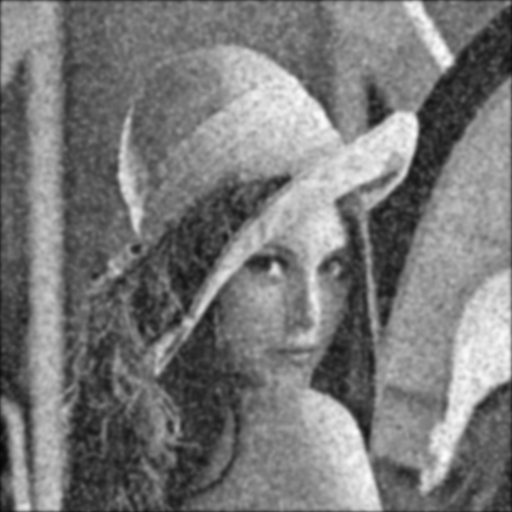

     * 空域中值滤波

       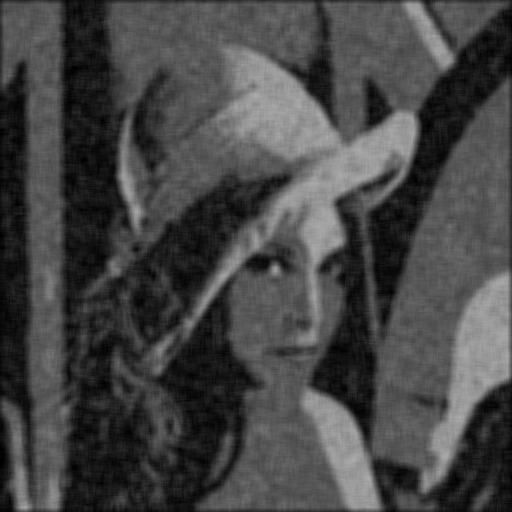

     * 空域高斯滤波

       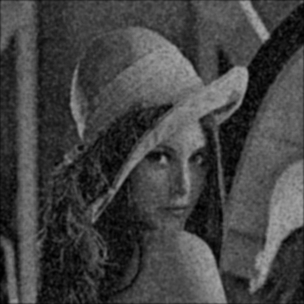

     之后通过调节Q的值，实现不同滤波器的效果：

     * Q=0.5时  可以滤除胡椒噪声

       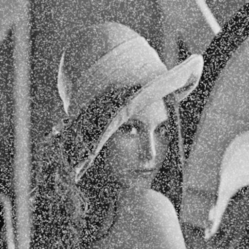

     * Q=0时  相当于算术均值滤波器

       

     * Q=-0.5时  可以滤除盐噪声

       

     * Q=-1时  相当于谐波均值滤波器

       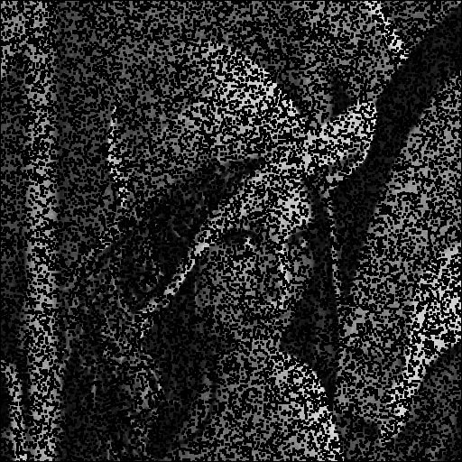

   * 结果分析

     由上面的运行结果可以看出，几种滤波器都可以对椒盐噪声进行滤除，但前四种滤波器无法对滤除信息进行选择。

     而逆谐波均值滤波器则可以对想要滤除的噪声进行选择：

     * 当Q>0时，可以滤除椒噪声，但无法处理盐噪声。
     * 当Q=0时，相当于算术均值滤波器，同时对椒噪声和盐噪声都有滤除效果。
     * 当Q<0时，可以滤除盐噪声，但无法处理椒噪声。

   ------------------------------------------

   

3. **维纳滤波器处理模糊图像**

   * 图像复原简介

     > 图像复原（image restoration）即利用退化过程的先验知识，去恢复已被退化图像的本来面目。

     基本思路：图像复原的基本思路：先建立退化的数学模型，然后根据该模型对退化图像进行拟合

     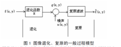

   * 运动模糊模型

     * 基本原理

     > 由于图像的传送和转换，总要造成图像的降质。在拍摄期间，如果相机与景物之间存在足够大的相对运动，就会造成图像的模糊，即为图像的运动模糊。

     其中，运动模糊的退化函数频域表达式如下：

     .gif)

     将该退化函数的频域函数与原图傅里叶变换后的频域表达式相乘可以得到模糊后的图像。

     * 实验结果

       图像运动模糊的参数设为：*a=0.03,b=0.03,T=1*,将图像模糊后，再添加上均值为0，方差为10的高斯噪声，可得到如下的结果：

       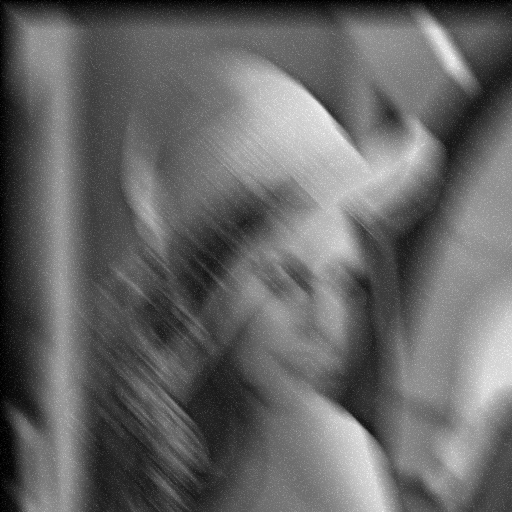

       

   * 维纳滤波器滤波

     * 基本原理

       > 维纳滤波（wiener filtering) 一种基于最小均方误差准则、对平稳过程的最优估计器。这种滤波器的输出与期望输出之间的均方误差为最小，因此，它是一个最佳滤波系统。它可用于提取被平稳噪声污染的信号

       在实际操作中，维纳滤波的过程往往使用如下的表达式进行操作：

       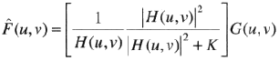

       其中，需要选取相关的K值使得滤波的效果达到最佳，而最优的判据可以通过使MSE达到最小来决定：

       .gif)

     * 实验结果

       在实现维纳滤波后，计算MSE的值，取MSE相对最小时的k值作为最优参数，经过测试可得当**k=0.001**时滤波效果相对最好，可以的得到结果如下：

       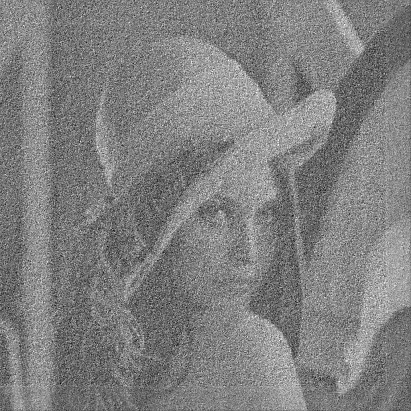

     * 结果分析

       由运行结果可见，维纳滤波可以将图像的大部分信息进行还原，但由于高斯噪声和运动模糊的影响，复原的图像仍然存在噪声，且和原图有较大噪声。并且，由于C++无法便利的实现函数的最优值求解，因此最优的K值较难取得，导致最后的效果不理想。

   * 约束最小二乘滤波

     * 基本原理

       > 最小二乘滤波亦称无系统参数的最小二乘配置.由观测数据确定随机参数最佳估值的一种方法.即在其函数模型中不包含非随机参数的部分(参见“最小二乘配置”)。

       约束最小二乘滤波采用拉普拉斯变换解决噪声敏感性的问题，选取一个最小准则函数C，定义如下：

       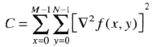

       其约束条件如下：

       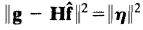

       最后得到目标图像的转换函数：

       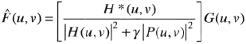

       

     * 运行结果

       在实验中，实现约束最小二乘滤波后，不断调节γ的值，使得其接近于约束条件所满足的关系，最后确定γ大致为0.7左右时，效果最佳，其滤波效果如下：

       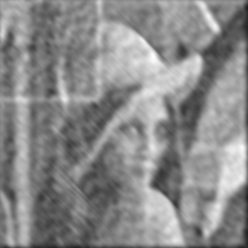

     * 结果分析

       由图可以看到，最小约束二乘也同样能够将原图的大部分信息进行还原。但是由于在计算的过程中存在着信息损失，并且最优的γ值难以获取，导致滤波结果并不十分理想，但是相较于前一步的维纳滤波，图像的亮度要更接近于原图。

     ---------------------------------------

     